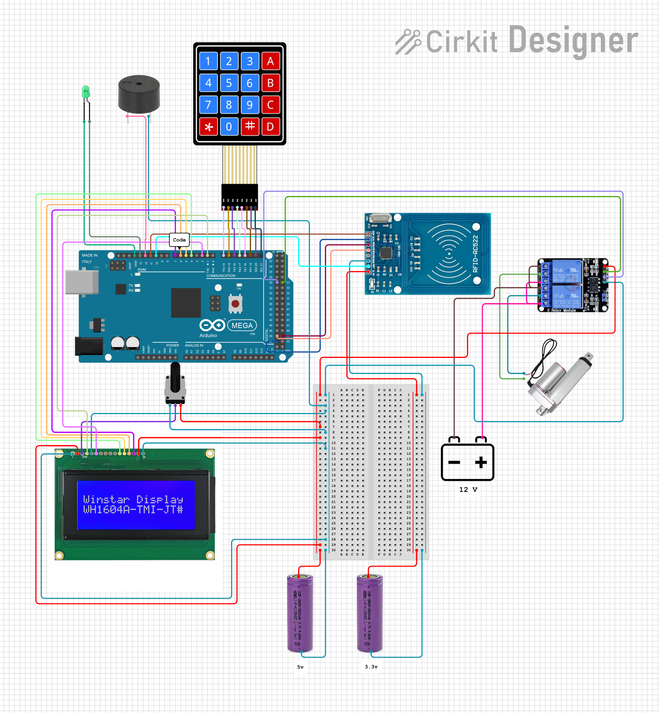

<h1>Circuit Documentation</h1> 
<h2>Summary</h2> 

This project is like a toy for my kids. It opens a safe door by linear actuator. It activates by inputting the result of calculations. LCD screen displays some math tasks (for example 4*8), if the answer is correct, the safe door starts to open. Also the circuit allows the use of RFID for opening the door of the safe.

This circuit integrates various components controlled by an Arduino Mega 2560 microcontroller to perform a range of functions. The circuit includes an RFID-RC522 module for RFID reading, a 16x4 LCD display for user interface, a 4x4 membrane matrix keypad for input, a two-channel relay to control a linear actuator, a green LED for indication, a buzzer for audio signaling, and a rotary potentiometer to adjust the contrast of the LCD display. The circuit is powered by a 3.3V and 5V for low-voltage components and a 12V for the actuator.

<h2>Component List</h2> 
<b>Arduino Mega 2560:</b> A microcontroller board based on the ATmega2560, with numerous digital and analog I/O pins. 
<b>16x4 LCD Display:</b> A liquid crystal display capable of showing 4 lines of 16 characters each. 
<b>RFID-RC522:</b> An RFID reader/writer module operating at 13.56 MHz. 
<b>4x4 Membrane Matrix Keypad:</b> A keypad with 16 buttons arranged in a 4x4 grid for user input. 
<b>9V AC/DC adapter:</b> A power source for Arduino by itself. 
<b>LED (Green):</b> A two-pin light-emitting diode for indication purposes. 
<b>Buzzer:</b> An electronic component that produces sound. 
<b>Two Channel Relay 5V:</b> A relay module with two channels that can control high power devices. 
<b>Linear Actuator:</b> A device that creates motion in a straight line, controlled by the relay. 
<b>12V AC/DC Adapter:</b> A power source for the relay and actuator. 
<b>Rotary Potentiometer:</b> A variable resistor with a knob used to adjust the LCD contrast. 
<h2>Wiring Details</h2>
<h3>Arduino Mega 2560</h3>
<b>D11</b> PWM to RFID-RC522 SDA 
<b>D52</b> to RFID-RC522 SCK 
<b>D51</b> to RFID-RC522 MOSI 
<b>D50</b> to RFID-RC522 MISO 
<b>D10</b> PWM to RFID-RC522 RST 
<b>D13</b> PWM to LED anode 
<b>GND</b> to LED cathode 
<b>D12</b> PWM to Buzzer PIN 
<b>D30</b> to Relay IN1 
<b>D31</b> to Relay IN2 
<b>D14/TX3</b> to Keypad R1 
<b>D15/RX3</b> to Keypad R2 
<b>D16 PWM/TX2</b> to Keypad R3 
<b>D17 PWM/RX2</b> to Keypad R4 
<b>D18/TX1</b> to Keypad C1 
<b>D19/RX1</b> to Keypad C2 
<b>D20/SDA</b> to Keypad C3 
<b>D21/SCL</b> to Keypad C4 
<b>D7 PWM </b>to LCD DB7 
<b>D6 PWM</b> to LCD DB6 
<b>D5 PWM</b> to LCD DB5 
<b>D4 PWM</b> to LCD DB4 
<b>D1 TX0</b> to LCD RS 
<b>D2 PWM</b> to LCD E 
<h3>16x4 LCD Display</h3>
<b>LEDK, VSS, RW</b> to GND 
<b>LEDA, VDD</b> to 3.3V 
<b>VO</b> to Rotary Potentiometer wiper 
<b>DB7, DB6, DB5, DB4, RS, E</b> to Arduino Mega 2560 
<h3>RFID-RC522</h3>
<b>VCC (3.3V)</b> to 3.3V Battery + 
<b>RST</b> to Arduino Mega 2560 D10 PWM 
<b>GND</b> to 3.3V Battery - 
<b>IRQ</b> (Not connected) 
<b>MISO</b> to Arduino Mega 2560 D50 
<b>MOSI</b> to Arduino Mega 2560 D51 
<b>SCK</b> to Arduino Mega 2560 D52 
<b>SDA</b> to Arduino Mega 2560 D11 PWM 
<h3>4x4 Membrane Matrix Keypad</h3>
<b>R1</b> to Arduino Mega 2560 D14/TX3 
<b>R2</b> to Arduino Mega 2560 D15/RX3 
<b>R3</b> to Arduino Mega 2560 D16 PWM/TX2 
<b>R4</b> to Arduino Mega 2560 D17 PWM/RX2 
<b>C1</b> to Arduino Mega 2560 D18/TX1 
<b>C2</b> to Arduino Mega 2560 D19/RX1 
<b>C3</b> to Arduino Mega 2560 D20/SDA 
<b>C4</b> to Arduino Mega 2560 D21/SCL 
<h3>LED (Green)</h3>
<b>Anode</b> to Arduino Mega 2560 D13 PWM 
<b>Cathode</b> to GND 
<h3>Buzzer</h3>
<b>PIN</b> to Arduino Mega 2560 D12 PWM 
<b>GND</b> to GND 
<h3>Two Channel Relay 5V</h3>
<b>VCC</b> to 3.3V Battery + 
<b>IN1</b> to Arduino Mega 2560 D30 
<b>IN2</b> to Arduino Mega 2560 D31 
<b>GND</b> to GND 
<b>NO1, NO2</b> to 12V Battery + 
<b>NC1, NC2</b> to 12V Battery - 
<b>C1</b> to Linear Actuator + 
<b>C2</b> to Linear Actuator - 
<h3>Linear Actuator</h3>
<b>+</b> to Relay C1 
<b>-</b> to Relay C2 
<h3>Rotary Potentiometer</h3>
<b>Leg1</b> to GND 
<b>Wiper</b> to LCD VO 
<b>Leg2</b> to 3.3V    

<h2>Watch the video</h2>
 

<h2>Circuit:</h2>
 

